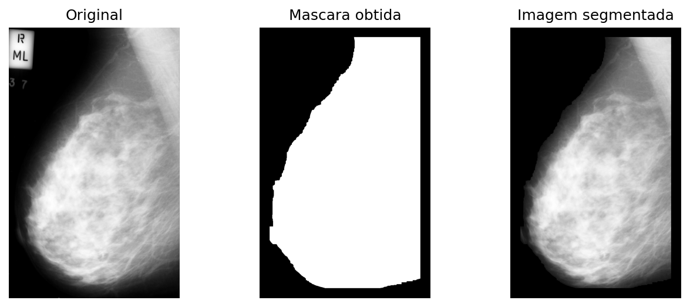
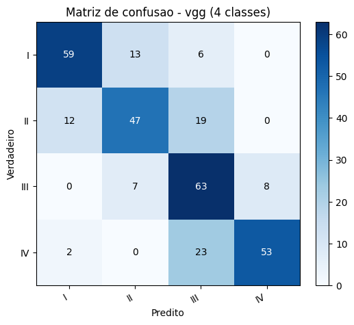

# BI-RADS Mammography CNN

Aplicativo gráfico (Python/Tkinter) que **segmenta a mama** e **classifica a densidade mamária (BI-RADS I–IV)** em mamografias, usando *transfer learning* com **VGG16** e **EfficientNet-B0**, segmentação clássica de imagens (CLAHE, Otsu, componentes conexas, crescimento de região) e explicabilidade por **Grad-CAM**.



## Sobre

A densidade da mama (escala BI-RADS, do *American College of Radiology*) está associada ao risco de câncer e à redução da sensibilidade da mamografia, pois um tecido mais denso pode ocultar lesões. Este projeto implementa um aplicativo completo que lê mamografias, isola a mama do fundo e das anotações, e reconhece a densidade automaticamente.

Além do básico, o trabalho é um estudo comparativo controlado de **16 experimentos**: 2 redes × base **congelada** vs ***fine-tuning*** × peso de classe **automático** vs **fixo** × tarefa **binária** vs **4 classes**.

## Funcionalidades

- Leitura e visualização de PNG/TIFF (qualquer resolução, 8–16 bits) com zoom
- Segmentação automática da mama: CLAHE → Otsu → maior componente conexa → crescimento de região
- Aumento de dados por rotação (−20° a 20°, 5 variações por imagem)
- Treino e avaliação em **binária** (I+II vs III+IV) e **4 classes** (I/II/III/IV)
- Seletor de estratégia: base **congelada** ou ***fine-tuning***; peso de classe **automático** ou **fixo**
- Métricas (sensibilidade, especificidade, precisão, acurácia, F1), matriz de confusão e tempos
- Explicabilidade com **Grad-CAM** sobre a imagem classificada

## Estrutura do projeto

```
.
├── main.py              # aplicativo gráfico: segmentação + classificação + Grad-CAM
├── segmentacao.ipynb    # notebook de exploração da segmentação
├── requirements.txt
├── dataset_exemplo/     # 1 imagem por classe (amostra para testar a interface)
│   ├── D/  → BI-RADS I
│   ├── E/  → BI-RADS II
│   ├── F/  → BI-RADS III
│   └── G/  → BI-RADS IV
├── outputs/             # métricas, matrizes de confusão e curvas dos 16 experimentos
│   ├── com_congelamento/
│   └── sem_congelamento/
└── relatorio/           # relatório técnico (PDF + fontes LaTeX + figuras)
    ├── relatorio.pdf
    ├── relatorio.tex
    └── *.png
```

> `dataset/` (completo) e `models/` (pesos `.pth`) não são versionados — veja `.gitignore`.

## Requisitos

- Python 3.10+
- PyTorch, torchvision, OpenCV, NumPy, Matplotlib (ver `requirements.txt`)
- GPU NVIDIA é opcional: acelera o treino, mas o app também roda em CPU

## Instalação

```bash
git clone https://github.com/<seu-usuario>/birads-mammography-cnn.git
cd birads-mammography-cnn

python -m venv .venv
# Windows:        .venv\Scripts\activate
# Linux / macOS:  source .venv/bin/activate

pip install -r requirements.txt
```

Para usar GPU, instale o PyTorch com CUDA (instruções no final do `requirements.txt`).

## Como rodar

```bash
python main.py
```

Na interface:

1. **Abrir imagem** (PNG/TIFF) e **Segmentar mama**
2. **Selecionar diretório do dataset** e ver o **resumo treino/teste**
3. Escolher rede, tarefa, **congelamento** e **peso**, e **Treinar rede** (ou rodar os 4 experimentos em lote)
4. **Avaliar conjunto de teste** (métricas + matriz de confusão + tempos)
5. **Classificar imagem + Grad-CAM**

## Dataset

O dataset completo **não está incluído** (tamanho e restrições de uso das imagens). A pasta **`dataset_exemplo/`** traz **1 imagem por classe**, apenas para experimentar a interface e a segmentação. A estrutura esperada pelo app é `dataset/<D|E|F|G>/*.png`, onde `D, E, F, G` correspondem a BI-RADS `I, II, III, IV`.

A divisão é automática: imagens com **número múltiplo de 4** vão para **teste**; as demais, para **treino**.

## Resultados (resumo)

16 experimentos avaliados em um conjunto de teste balanceado (78 imagens por classe). Destaques:

| Rede | Tarefa | Estratégia | Acurácia |
|---|---|---|---|
| VGG16 | 4 classes | fine-tuning | **0,712** |
| EfficientNet-B0 | binária | fine-tuning | **0,865** |

O *fine-tuning* superou de forma consistente a base congelada (sobretudo nas 4 classes), e a ponderação fixa reequilibrou a classe mais difícil (II). Análise completa em **[`relatorio/relatorio.pdf`](relatorio/relatorio.pdf)**.



## Autores

- Arthur Martinho Medeiros Oliveira
- Luis Augusto Starling Toledo
- Túlio Gomes Braga

## Aviso

Projeto acadêmico de processamento e análise de imagens. **Não é um dispositivo médico** e não deve ser usado para diagnóstico clínico.
